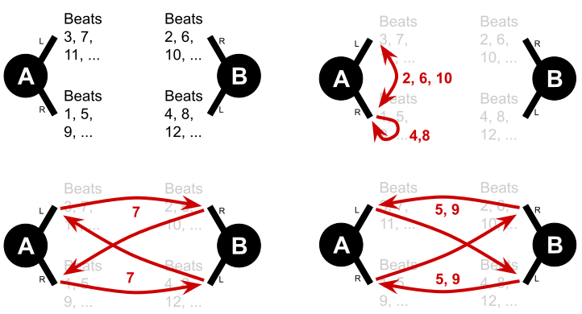
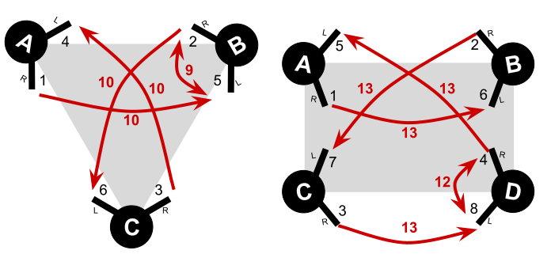

# A bit of siteswap theory and lore

](https://upload.wikimedia.org/wikipedia/commons/d/d1/Siteswap_relative_visualized.png)
*Visualization of traditional solo siteswap throws by [Hyacinth](https://commons.wikimedia.org/wiki/File:Siteswap_relative_visualized.png)*

## Siteswap basics
Siteswap notation dates back to the 1980s. It describes a sequence of throws with numbers, where each number represents how many beats later a thrown object will be thrown again. For example, a 4 describes that the object thrown now will be thrown again four beats later after three other throws.
Traditional siteswaps assume a single juggler with two hands who alternates throws from both hands, so a siteswap *441* would be read as a right-handed 4 throw, followed by a left-handed 4 throw, followed by a right-handed 1 throw, then repeating on the other side. As a consequence any odd-numbered throw crosses from one hand to the other (i.e., it gets rethrown an odd number of beats later when it is the other hand's turn) and all even-numbered throws return to the same hand. 

## N-handed siteswaps
Nothing in the siteswap notation or theory requires juggling with two hands. Siteswaps merely describe after how many beats an object is thrown again, and based on which hand's turn it is on that beat we figure out where we need to throw the object. Patterns can be juggled with 1 hand, 3 hands, or 16 hands; we do not even need to assume that the hands always alternate. 

Four-handed siteswaps are one way to interpret siteswaps for two passers with four hands total: We assume two passers facing each other with passer A throwing with the right hand on beat 1, passer B throwing with the right hand on beat 2, passer A throwing with the left hand on beat 3, and passer B throwing on the left hand on beat 4, before it all repeats on beats 5, 6, 7, and 8 -- as shown in the diagram below. That is, all odd beats are thrown by passer A and all even beats by passer B. 

From this, all the standard throws in four-handed siteswaps can be derived: 

* A 4 (flip) gets rethrown four beats later from the same hand, but there is only a single beat from the same passer before then. An 8 (heff) gets rethrown eight beats later from the same hand, while that same hand has another throw before then, four beats later.

* A 6 (self) gets rethrown six beats later from the passer's other hand, a 2 (zip) two beats later with the passer's next throw, and an *a* (trelf) gets rethrown 10 beats later.

* A 7 (single pass) gets rethrown seven beats later by the other passer. The straight/crossing passes approach where passer A throws straight single passes and passer B throws crossing single passes follows directly from the hand sequence: A right-hand single pass from passer A on beat one gets rethrown on beat 8, which is a left-hand throw from passer B, whereas a right-hand single pass from passer B on beat 2 is rethrown on beat 9 which is a right-hand throw from passer A.

* A 5 (zap) and 9 (double pass) are crossing for passer A and straight for passer B following the same mechanism.

* A 1 would be a very very fast pass (faster than a zip), that gets immediately rethrown on the next beat by the other passer; there is no plausible way of juggling this. A 3 is a very fast pass, which is technically feasible if slowing everything down a lot, but not commonly juggled. Hence, lists of four-handed siteswaps generally exclude patterns with 1s and 3s.

Assuming that both passers juggle at a normal speed, all numbers are twice as high as in solo (two-handed) siteswaps, as we have twice the number of beats in the same time.

The same way we define a four-hand sequence for two passers, we can define a six-hand sequence for three passers, an eight-hand sequence for four passers, and so forth. We now have much higher numbers, as there are even more beats in the same amount of time. In the following, we illustrate the hand sequence and the throws that represent selfs and single passes. For example, as a start, try the 6-handed siteswap *a899* and *aa79* or the 8-handed siteswap *fcc* ("three-count friction").

## Transforming siteswaps
There are a number of common transformations that can be used to transform a pattern into other patterns.

**Adding/removing clubs.** It is possible to add the length of the siteswap to any individual throw to get a pattern with one more object. For example, the 6-club pattern 972 of length 3, can be transformed into the 7-club pattern 975 (holy grail) by adding 3 to the last throw, and then be transformed into the 8-club pattern 978 by adding 3 to that throw again, which can then be transformed into the 9-club pattern 9a8 by adding 3 to the second throw. Conversely, removing the length of the pattern from any throw yields a pattern with one club less, such as transforming the 6-club pattern 972 into the 5-club patterns 672 (5-club one-count) or 942. 

This transformation is useful in many passing patterns to make them incrementally harder (or easier) without changing the pattern otherwise. In siteswaps of length 3, all zips can be turned into zaps, all zaps can be turned into heffs, all flips into singles, all singles into trelfs, and all selfs into doubles  -- and vice versa. In siteswaps of length 5, all zips can be turned into singles (e.g., 777**2**2 to 777**7**2 and 5**2**585 to 8**7**585), and, in siteswaps of length 7, all zips can be turned into doubles.

It is also possible to add 1 to every throw to add a club to the pattern, for example, turning the 6-club pattern 45678 into the 7-club pattern 56789 and turning 77786 (funky bookends) into 88897. However, this usually changes the character of the pattern substantially.

**Swapping throws.** Siteswaps get their name from a manipulation that *swaps* the landing places of two throw *sites*. Any two throws in a pattern can be changed such that the first throw lands where the second would have landed and the second lands where the first would have landed. This is the logic behind *early doubles:* Throw a higher pass earlier to where the normal pass would have landed and then make up for it with a lower throw later instead of the original pass -- the two throws have swapped their landing sites. Generally two throws *x* and *y* that are *n* beats apart can swap into *y+n* and *x-n* -- for example transforming solo siteswap **44**1 into **53**1 and **5**3**1** into **3**3**3**.

This transformation is commonly useful in four-handed siteswaps to think of compatible variations of a pattern, such as early doubles or extra trelfs, either as a one-time trick throw or as a different pattern.
In practice, we are usually interested in transformations from the perspective of one passer, thus transform two consecutive throws of one passer, which are two beats apart in the siteswap. For example, we can turn the local sequence single-single into double-zap (e.g., **7**7**7**22 to **9**7**5**22) or heff-pass into double-self (e.g., 77**8**6**7** to 77**9**6**6**).

**Repeating and shifting the pattern.** It is probably obvious at this point, but 7, 77, and 777 are effectively the same pattern, as are 786 and 786786. Also 786, 867, and 678 are the same pattern, just shifting the start. In lists, siteswaps are usually normalized -- without repetitions and starting with the highest throw -- rather than selected for a convenient start.

To create compatible siteswaps it is useful to repeat an odd-length siteswap twice and then manipulate the resulting even-length siteswap with another transformation. For example, 786**7**8**6** can be transformed by swapping the landings of beat 4 and 6, resulting in 786**8**8**5**, that is, creating the compatible siteswaps 786 and 858.

## Diagrams

Several diagrams are common to depict siteswaps, usually developed for solo siteswaps. For example, just like we illustrate passer A and passer B on separate lines, in a solo siteswap a diagram may show the alternating actions of the right and left hand in two lines.

Moreover, there are two common ways of showing the throws in a pattern as lines: ladder diagrams and causal diagrams. In a *ladder diagram*, a line illustrates the path of an object from where it is thrown to where it is thrown again next. This is a ladder diagram for French three-count (786):

<siteswap style='{"showLadderLines": true, "iterations":6, "causalLineWidth":3,"causalLineColor":"green","yDist":60,"yMargin":10}'>786</siteswap>  

In such diagram, we can observe the path that a club takes, for example, that the self in 786 is always the same club and that all heffs turn into a passes.

Note that a throw lands quite a bit before it gets thrown again. It lands somewhere between the beat it is thrown again and the previous action of the same hand happening 4 beats earlier in a four-handed siteswap. This previous action is necessary to empty the hand to catch the incoming throw -- we say that that action was *caused* by the incoming throw.

A *causal diagram* illustrates how throws cause the passer to do other actions to empty their hands, that is, they illustrate which throw triggers which other throw rather than illustrating the path of individual objects. This is the causal diagram for the same pattern French three-count (786):

<siteswap style='{"showCausalLines": true, "iterations":6, "causalLineWidth":3,"causalLineColor":"blue","yDist":60,"yMargin":10}'>786</siteswap>  

We can see that we always throw a single pass to catch an incoming single pass (i.e., 7 causes 7), and we always throw a self to catch a heff (8 causes 6) and vice versa. The fact that singles cause singles in patterns of length 3 (and doubles cause doubles in patterns of length 5) is why these patterns easily fall apart when those passes are too low and fast (see [Improve your siteswap passing]()).

In the passing community, ladder diagrams are rarely used other than for determining starts and color coding (see below), but causal diagrams are more common, especially for reasoning about takeouts.

## How to start a pattern

**Determining starting hands.** In a ladder diagram, it is very easy to see which hand starts with how many clubs, simply by counting the beats in the beginning without incoming lines. In the ladder diagram for French three-count diagram above, we can see that passer A throws four throws (two right and two left handed) before throwing the first caught club (a self) and passer B throws three throws before rethrowing a caught club.

This also works for less intuitive starts like the start of 972, where we can see that passer A has only one right-handed throw without an incoming club but two left-handed throws:

<siteswap style='{"showLadderLines": true, "iterations":4, "causalLineWidth":3,"causalLineColor":"green","yDist":60,"yMargin":10}'>972</siteswap>  

Similarly, we can count the hand without incoming lines in causal diagram and add one club to each hand (one less if the very first action is a zip).

**Avoid skipping initial beats.** Some common patterns are often taught with starts that skip the first beat for the second passer. For example, it is common to start 7-club three count with a right-handed straight double, and for the other passer to start "as late as possible" with a right-handed crossing double, which should be *three beats later*. This works but requires to practice a new timing. We argue it is better to start all four-handed siteswaps one beat apart, that is, passer A should start with a crossing double from the right hand and passer B should start just afterward with a self from the right hand, followed by a straight double from the left hand as clearly indicated by the notation:

<siteswap>966</siteswap>

**Selecting a beat to start.** Since siteswaps can be shifted, it is possible to start on every beat. There is no single right way to start a siteswap, but some starts are usually better than others.

We usually do not consider starts where a club would need to be caught with a non-empty hand, such as the first throw of starting 972 on the 2:

<siteswap style='{"showLadderLines": true, "iterations":4, "causalLineWidth":3,"causalLineColor":"green","yDist":60,"yMargin":10}'>297</siteswap>  

Beyond that, we usually prefer starts where (1) the first throw of passer A is a pass, (2) the first throw of passer B is a pass, (3) the number of starting clubs is the same in both hands or the right hand has one more club, and (4) the number of starting clubs are relatively balanced between the passers. 

It is not always possible to satisfy all four preferences. For example, among the two remaining starts of 972, both violate at least one preference: Starting with the double requires juggler A to start with two clubs in the left hand (violating preference 3). Starting with the single requires juggler B to start with a non-pass, with two clubs in the right and an empty left hand (violating preferences 2 and 3). Despite not satisfying all preferences, the start with the double seems overall the better start.

<siteswap style='{"showLadderLines": true, "iterations":4, "causalLineWidth":3,"causalLineColor":"green","yDist":60,"yMargin":10}'>729</siteswap>

With a siteswap animator like [passist.org]() it is easy to cycle through the various starts and pick a nice one.

## Orbits and color coding

Following a pass in a ladder diagram identifies its orbit, that is the sequence of throws until the club repeats the same path through the pattern. Clubs that always repeat only a single action are called magic and can be highlighted by using a club of a different color. Zaps and trelfs in siteswaps of length 5 are always magic, and so are selfs and doubles in siteswaps of length 3 and singles in siteswaps of length 7. 

<siteswap style='{"showLadderLines": true, "iterations":4, "causalLineWidth":3,"causalLineColor":"green","yDist":60,"yMargin":10, "emphasizeThrows":[0,5,10,15], "emphasizeCausal":[0,5,10,15]}'>56784</siteswap>

## Terminology

The passing community has now adopted a couple of terms that may not be broadly known among beginners or people who learned passing a long time ago. Some terms simply became popular and spread through the community.

A *heff* is not an abbreviation but was simply a random short term or a misheard version of the letter *f* for fountain, depending on who you ask. It has spread because "double self to the same hand" really needs a shorter alternative.

A *trelf* is a more recent attempt to disambiguate triple selfs from triple passes with a short term. It is not as broadly used, but I adopt it to have a distinct short word for all throws.

The *zap* was originally discovered when playing with the early passing animator [JoePass!](http://koelnvention.de/w/?page_id=151) Based on the software's name, they were sometimes called *joe passes,* but now the name zap is much more common.

In this book, I use *passer A* and *passer B* and assume that passer A starts and throws straight single passes and crossing zaps and doubles. This is arbitrary. When agreeing on a side, it is common to negotiate who is throwing straight and crossing passes. As a running gag, some in the community have adopted *"James"* as the name for the passer with straight singles and *"Not James"* as the name for the passer with crossing singles. Alternatively, some have suggested *"James"* and *"Jims,"* because the latter throws crossing singles as in Jim's three count.
