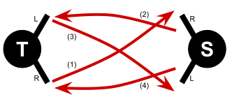
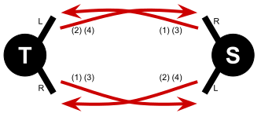

# Learn to pass / teach to pass

Next: [Synchronous passing notation](2a-intro-notation.md) or [Four-handed siteswap notation](4a-4hsw-notation.md)

## 5-club one count

The most effective way to teach beginners passing is to teach them *5-club one count*. Especially if one passer is more experienced, it is possible to teach almost everybody passing within minutes and get them to experience success, even if they have never tried to juggle clubs before. As it allows for more control and feedback and trains both hands equally, this approach is much more effective than the traditional approach of first requiring a solo cascade pattern and then learning [6-club four count]() as the first pattern. This approach was first introduced by Amiel Martin and published on [passingpedagogy.com](https://web.archive.org/web/20240511104511/https://www.passingpedagogy.com/); it has since been widely taught in workshops.

In the following I assume a more experienced *teacher* and a less experienced *student*. While it is easier to get to success with a more experienced *teacher*, who can throw good passes and recover from less good responses, the same sequence also works with two beginners.

**Step 1: Practicing passing throws in isolation.** The teacher has a single club, the student has two empty hands. The teacher throws a lofty crossing pass from the right hand with a single spin. Ideally the student can catch the club comfortably with the right hand at about shoulder height. The student then throws a lofty straight pass back to the teacher, from the student's right hand to the teacher's left hand. This is followed by a lofty crossing pass from the teacher's left hand to the student's left hand, and finally followed by a lofty straight pass from the student's left hand to the teacher's right hand.

*Illustration of the four passes between the teacher (T) and the student (S).*

Use this first step to practice passes, watch them land, and correct with the next throw if needed. Passes will often be too spiny, too short, too fast, or too low. Passes should be lofty and should be caught with an open hand facing the other passer roughly at shoulder height, maybe 10 to 20 cm (4-8 inch) diagonally in front of the shoulder. It is a good exercise for the teacher (a) to hold the empty hand where they want to catch the club as a reference point for the student to aim for, and (b) to provide feedback on what to correct.

[TODO: Photo of where to catch]
 
When throwing the pass, *avoid spinning the club from the wrist* – keep the wrist fixed. Adjust height and length of the throw primarily by controlling how much to move the lower arm (bending at the elbow) and when to release the club. For extra far throws, also the upper arm might be involved (moving from the shoulder joint) but that is rarely needed. If the club is not spinning enough, correct by throwing it higher, not by spinning it more. When avoiding spinning from the wrist, it does not matter much where exactly to grip the club; usually grab it anywhere comfortably at the handle, some people like to slide it down to the knob for every pass.

[TODO: Photo or graphic with the path of a club]

**Step 2: Responding to a pass with a pass.** The teacher has a single club in the right hand and the student has one club in each hand. The teacher throws a lofty crossing pass and the student responds by throwing a lofty straight pass from the right hand back to the teacher's left hand in response, before catching the club with the now empty right hand. Students often want to throw their responding pass very early – delay it as long as possible – it is thrown when the incoming club starts to descend, more than half-way across the pattern. The responding pass is thrown *underneath* the incoming pass, not outside of it. Once the first and the responding club are caught, the teacher repeats the sequence on the other side.

The teacher needs to throw lofty passes that are high and wide enough for the student to comfortably pass underneath – having good lofty crossing passes is more critical for the pattern than good straight passes, that is why we have the teacher throw them. The student's straight passes should be wide enough that the teacher can comfortably pass on the inside. If there are collision problems, the incoming pass is likely too short or too low. The student may need a few attempts to get comfortable with the timing to still throw good responding passes; practice on both sides, and go back to step 1 if needed. Find a rhythm that is slow and comfortable.

**Step 3: Continue the pattern.** Adding one more club, both teacher and student now start with one club in each hand. The teacher again starts with a lofty crossing pass, the student responds with a straight crossing pass, and now the teacher continues by responding with another lofty crossing pass, forcing the student to another response on the other side, which is caught by the teacher's empty hand. That is, we now have a sequence of four passes, involving all hands, teaching the speed of responding with alternating passes from both hands. Continue to pay attention to clean throws and catches and a generally slow rhythm.

If this is working well, a more experience teacher take a shortcut to 5-club one-count without telling the student by always handing the caught pass to the other hand to indefinitely continue the pattern (this is technically the four-handed siteswap 720). This can be done without any announcement and will often result in a student surprised about what they can do; adding another club for the final step will not make a difference from the student's perspective.

**Finally: 5-club one count.** Adding one more club again, the teacher starts with two clubs in the right hand and one club in the left hand, the student still has one club in each hand. The teacher starts with a lofty crossing pass and the rest is a continuous sequence of responses. This is it. This is 5-club one count. The student can also practice starting with three clubs, but should continue to do straight passes, unless they want to get ready to teach somebody else.

## Onward to 6-club one-count and 7-club one-count

With an experienced teacher, most students can learn 6-club one-count on their first day, and some even see first success with 7-club one-count. Both patterns will likely still be easier than learning 6-club four count.

To warm up for 6-club one-count, first pass three clubs between the teacher's left hand and the student's right hand. All passes are straight and thrown a little from the inside to the outside. Try to keep passes lofty. The responding passes are thrown *underneath* incoming passes, and collisions indicate too short or too low passes. Once this works, switch sides and pass three clubs between the teacher's right hand and the student's left hand. Finally, combine both sides, alternating right-hand and left-hand passes. The most common start is for both passers to have two clubs in their right hand and one club in their left hand and to start at the same time with a right-handed pass – a more experienced teacher might start with four clubs and a left-handed pass, whereas the student starts responding one beat later with a right-hand pass.

*Illustration of the passes between the teacher (T) and the student (S) in 6-club one-count. Both passers throw at the same time, alternating their right and left hand.* 

If the teacher is comfortable with *7-club one-count*, transitioning from *6-club one-count* to *7-club one-count* is a fairly small step for the student. The student continues a one-count pattern with lofty straight single passes, now at a marginally faster pace (most students speed up too much going from 6 to 7 clubs, it is really not much faster). The teacher has to carry the pattern though with lofty crossing passes, typically starting with four clubs and a lofty crossing pass from the left hand slightly before the student's right-handed start.

## What's next?

One-counts are great beginner patterns because the learner can focus entirely on passes, rather than focusing on separating passes and self throws. An experienced teacher can carry the pattern, so most incoming clubs for the student will be fairly stable, whereas other patterns often fall apart from bad self throws. One-counts also provide a good foundation for passing slow and lofty and for passing with both hands.

One the one hand, one-counts provide a good entry point for four-handed siteswaps (actually *5-club one-count* and *7-club one-count* are four-handed siteswaps: 744 and 7). To go this route, learn about the [notation](4a-4hsw-notation.md) and start with the [beginner patterns](4b-beginners.md), slowly introducing zips, flips, and selfs. For beginners, zips are easier to introduce than selfs, so good patterns to try next are 777742 (see [compatible siteswaps](4h-4hsw-compatible.md)) and 77722 (*Parsnip*, see [beginner patterns](4b-beginners.md)).

On the other hand, most other passers will have learned *6-club four-count* first and other [synchronous patterns](2b-basic-sync.md) next.  To have a wider range of passing partners at all levels, it is useful to learn those patterns too. They also are the foundation for most [group patterns](). Depending on how stable their cascade is, some beginners might find it easier to learn patterns with more self, like 6-count, and others might prefer starting with patterns with fewer selfs, such as *pass-pass-self*.

