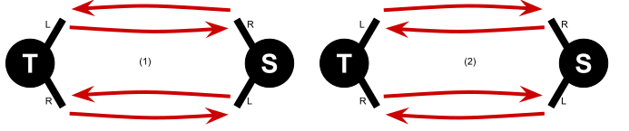

# Beyond classic synchronous patterns

Prerequisite: [Advanced synchronous patterns](https://en.wikipedia.org/wiki/Siteswap#Synchronous) | Next: [Four-handed siteswaps](https://en.wikipedia.org/wiki/Siteswap#Synchronous)

There are a number of patterns that generally fit with the theme of traditional synchronous patterns, but they push the go beyond the original patterns by modifying the throwing rhythm to squeeze the timing, resulting in throws that are lower than in the [initially described notation](2a-intro-notation.md):

| Symbol | Description     |
| ------ | ---- |
| 4x | Lofty single-spin self |
| 4p | Lofty single-spin crossing pass |
| 4px | Lofty single-spin straight pass |
| 5 | Double-spin self |
| 5p | Lofty double-spin straight pass |
| 6 | Heff: A double-spun self to the same hand |
| 6p | Triple-spin straight crossing pass in galloped patterns, double-spin in fully sync patterns |

## Gallops

For a number of one-sided patters it is common to juggle them lower than standard timing would require, but to fudge the timing by *galloping* the pattern, that is throwing a fast left-hand self quickly after the right-hand.

**7-club two-count on singles, 8-club two-count on doubles, and 9-club two-count on triples.** The most common galloped patterns are to throw 7-club two-count with lofty singles instead of doubles, followed quickly by a fast self from the left hand, and to throw 8-club two-count on doubles (instead of the triple needed for a non-galloped pattern). 

<sync style='{"gallop": true, "iterations":4}'>4p,o -> 34p,4p3</sync>

As explained for [7-club two-count on doubles](2d-advanced.md), it is most common to throw all straight passes from the right hand for both passers by swapping straight and crossing and starting hands

<sync style='{"gallop": true, "iterations":4}'>5p3</sync>

<!-- TODO: gallop rendering

dsdsdsds
-dsdsdsd

tstststs //gallop rendering
tstststs -->

**6-count popcorn on singles.** The standard [6-count popcorn]() can be juggled on singles and with a double-self instead of trelf if the pattern is galloped.

**Long beach popcorn.** This 8-club pattern has the right-hand sequence lofty-triple pass (instead of a quad), double-self (instead of a trelf), lofty single pass (instead of a double), while all left-hand actions are quick, galloped selfs.

<sync style='{"gallop": true,"flipStraightCrossing":true}'>6p,o -> 3534p36p,4p36p353</sync>

<!-- qstsdsqstsdsqstsds // render gallop
tsdsqstsdsqstsdsqs -->

See [Will Murray's pattern collection](https://home.csulb.edu/~wmurray/jugglingArticles/WillPatterns.pdf) for many more galloped patterns and theory of how to create more of them.

## Fully synchronized patterns

There are several patterns, where a passer's left and right hand always throw at the same time -- similar to [synchronous throws in solo siteswaps](https://en.wikipedia.org/wiki/Siteswap#Synchronous). That is, all four hands always throw at the same time. This effectively doubles the speed, as there are two actions on every beat, rather than one; passers usually compensate with lofty selfs and lofty passes to slow down to a manageable speed.

**Techno.** In this 7-club three-count variation a single pass and a self is thrown from both hands at the same time, followed by a single self on the next beat, before it all repeats on the other side. One passer crosses their passes. This pattern is helped by throwing very lofty passes and delaying passer B's start as long as possible. Technically, all hands from both passers throw at the same time, though in practice a slight gallop might help to learn the pattern.

<sync style='{"separateleftRightRows":true,"showLeftRight":false,"showStraightCross":false,"yDist":50,"throwTextSize": 22}'>(4p,4x)(4x,2)(4x,4p)(2,4x),(4x,2)(4x,4px)(2,4x)(4px,4x)</sync>

<video>https://www.juggle.org/tricks-in-three-count-causal-diagrams/</video>

**8-club two-count on singles, swing, and variations.** There are many variations on the fully synchronous 8-club two-count on singles. Again, all four hands throw at the same time, one hand throwing a self and one hand throwing a single pass. This pattern really benefits from lofty passes and lofty selfs. The traditional pattern most people learn first is fully right handed:

<sync style='{"separateleftRightRows":true,"showLeftRight":false,"showStraightCross":false,"iterations":8,"yDist":50,"throwTextSize": 22}'>(4px,4x),(4px,4x)</sync>

*Swing* (or *the swinging door*) is a challenging modern ambidextrous variation that alternates passes on the right and the left side of the pattern, while effectively juggling a cascade at the same time. Warm up with left-handed 8-club two-count and focus on lofty and narrow(!) selfs in the actual pattern.

<sync style='{"separateleftRightRows":true,"showLeftRight":false,"showStraightCross":false,"iterations":4,"yDist":50,"throwTextSize": 22}'>(4px,4x)(4x,4px),(4px,4x)(4x,4px)</sync>

As a variation, throw a crossing pass and a heffling (a self to the same hand/a single-spin heff) at the same time. This can be done as a trick throw or continuously. For example, alternating between straight and crossing passes provides an ambidextrous pattern that is compatible with right-handed 8-club two-count.

<sync style='{"separateleftRightRows":true,"showLeftRight":false,"showStraightCross":false,"iterations":4,"yDist":50,"throwTextSize": 22}'>(4px,4x)(4px,4x),(4px,4x)(4,4p)</sync>

This is also compatible against various scratch your hand patterns (see below). As usual, all straight passes can be turned into crossing passes and vice versa (see theory in [advanced synchronous patterns]())

**8-club one-count on singles.** Similar to two-count, it is possible to juggle 8-club one-count all synchronously, all four hands throwing at the same time. To avoid collisions, some lane management is needed. A good version to try is with all straight lofty single passes first throwing outside on the right and inside on the left, and then inside on the right and outside on the left for the second throw, but many other variations are possible.

*Example of two possible lanes for 8-club one-count synchronously, consider alternating between them.*

<crossreference>Also see the many other 8-club one-count variations in the appendix.</crossreference>

**9-club two-count on doubles.** A traditional one-sided pattern can be thrown fully synchronous or slightly galloped.

<sync style='{"separateleftRightRows":true,"showLeftRight":false,"showStraightCross":false,"iterations":8,"yDist":50,"throwTextSize": 22}'>(6px,4x)</sync>

**Scratch your head.** Throw a single pass and a heff at the same time; one passer is crossing (this can technically be seen as a siteswap transformation in techno, replacing self-self with heff-flip, though the flip is usually just held). While technically all synchronous, the actions of both jugglers alternate since they only hold a club on the off beat and only throw every other beat.

<sync style='{"separateleftRightRows":true,"showLeftRight":false,"showStraightCross":false,"iterations":2,"yDist":50,"throwTextSize": 22}'>(4px,6)(2,2)(6,4px)(2,2),(2,2)(4p,6)(2,2)(6,4p)</sync>

<video>https://www.juggle.org/tricks-in-three-count-causal-diagrams/</video>

There are a number of variations found and collected by Will Murray and described on his [web page](https://home.csulb.edu/~wmurray/), including a 5-club version (single pass and flip at the same time), a 9-club version (double pass and heff at the same time), and scratch your nose (one-sided with all straight passes, but crossing double selfs instead of heffs).

**Blinky.** Blinky is an unusual 8-club one-count variation in which passer A alternates straight single and straight double passes from both hands and passer B throws a straight single and a straight double pass at the same time. Passer A's clubs arrive at the same time, and passer B's clubs arrive alternating.

<sync style='{"separateleftRightRows":true,"showLeftRight":false,"showStraightCross":false,"iterations":4,"yDist":50,"throwTextSize": 22}'>(6p,4px)(2,2),(6p,2)(2,4px)</sync>

Passer A can also throw a crossing double and a crossing single, even just as a one-off trick, as they arrive at the same time anyway.

<crossreference>Also see the many other 8-club one-count variations in the appendix.</crossreference>

