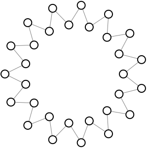

# Large Patterns

For large groups of passers, it is almost always better to break up into smaller groups. However, here are some ideas to include many passers.

## Speed Passing

Speed passing is speed dating for passers. This is commonly run as a workshop early in a juggling festival so that passers find who else attending the festival is interested in passing.

In a long line through the gym, passers meet in pairs. The passers in each pair introduce themselves and decide on a pattern to try. An organizer keeps the time and signals to change partners every 60 to 120 seconds (a whistle and a tabata workout timer work well for this). On each partner change, each passer moves a step to the right to pass with the next passer in line. At the end of the line, passers have a break for one round and then continue on the other side on the next partner change. This continues until everybody has passed with everybody else, or time runs out.

<html-only>

<sync-group style='{"components": ["layout"], "showAnimationCounter": false, "cropLayout": [0,0,70,0]}' frames="0,6">
A: 3pJ3pJ3pJ3pJ333pI3pI3pI3pI33 -- B
B: 3pI3pI3pI3pI333pH3pH3pH3pH33 -- C
C: 3pH3pH3pH3pH333pG3pG3pG3pG33 -- D
D: 3pG3pG3pG3pG333pF3pF3pF3pF33 -- E
E: 3pF3pF3pF3pF33333333 -- F
F: 3pE3pE3pE3pE333pD3pD3pD3pD33 -- G
G: 3pD3pD3pD3pD333pC3pC3pC3pC33 -- H
H: 3pC3pC3pC3pC333pB3pB3pB3pB33 -- I
I: 3pB3pB3pB3pB333pA3pA3pA3pA33 -- J
J: 3pA3pA3pA3pA33333333 -- A
positions: Svg(speedpassing.svg,A,0,B,2,C,4,D,6,E,8, F,10,G,12,H,14,I,16,J,18)
move:move(*,3.9,1)move(*,9.9,1)
</sync-group>

</html-only>

Encourage passers to try ambitious patterns and to switch patterns when they switch partners. If passers want to drop out early, they ideally do so only at the ends or together with their current partner.

## Very Long Feeds

As shown earlier, it is possible to [chain multiple feeds](./5b-feeds.md). The simplest way to scale this with similar-length passes is to extend the feed in a zig-zag line, where everybody feeds two other feeders, except for the two feedees at the very end. With very large numbers of passers, this zig-zag line can even be bent into a large circle to connect the ends, so that everybody feeds. This can be juggled on any base pattern.

<!-- typ-figure: width: 30% -->

## Skinny Loopy Feast

The [Feast](./5c-static-groups.md) pattern conceptually works for any number of passers, but with enough passers the circle will be very large and some passes will be exceedingly far while others are very short. One way to solve the problem is to turn the feast pattern into a walking pattern with two lines that maintains all passes at a similar length:

<sync-group style='{"components": ["layout"], "showAnimationCounter": false, "cropLayout": [0,0,70,0]}' frames="0,1.5">
A: 3pI3 -- B
B: 3pH3 -- C
C: 3pG3 -- D
D: 3pF3 -- E
E: 3  3 -- F
F: 3pD3 -- G
G: 3pC3 -- H
H: 3pB3 -- I
I: 3pA3 -- J
J: 3  3 -- A
positions: Svg(skinnyfeast.svg,A,0,B,1,C,2,D,3,E,4, F,5,G,6,H,7,I,8,J,9)
move:move(*,0.9,1)
</sync-group>

<!-- typ-no-link-footnote: madjugglers.com -->
<!-- typ-no-link-footnote: jugglingedge.com -->

Beyond these, the [Madison Area Jugglers Pattern Book](https://madjugglers.com/majpatternbook/) and the  [Passing Patterns Compendium](https://jugglingedge.com/pdf/passingpatternscompendium.pdf) have many more patterns for large groups of passers. 

<!-- typst: #qr_with_label_pair("https://madjugglers.com/majpatternbook/", [Madison Area Jugglers Pattern Book], "https://jugglingedge.com/pdf/passingpatternscompendium.pdf", [Passing Patterns Compendium]) -->
